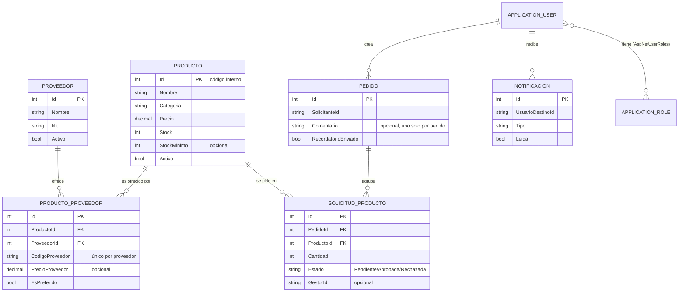

# Dominio y casos de uso — CatalogoPedidos

Este documento describe la **idea de negocio**, el **modelo de dominio** (entidades y
tablas intermedias) y los **casos de uso** de CatalogoPedidos, tal como quedaron
implementados en el código — no es una propuesta, es un reflejo del sistema actual.
Para mejoras pendientes o ya hechas sobre este modelo, ver
[Propuestas de mejora](MEJORAS_PROPUESTAS.md).

## 1. Idea de negocio

CatalogoPedidos resuelve el ciclo interno de compras de una organización:

1. Un **catálogo** centraliza los productos disponibles, cada uno asociado a uno o
   varios **proveedores** externos que lo suministran, cada proveedor con su **propio
   código** para ese producto (su SKU/referencia), independiente del código interno que
   el sistema asigna automáticamente.
2. Cualquier empleado (**Solicitante**) arma un carrito con los productos que necesita y
   lo envía como un único **Pedido** — puede llevar varios productos y un comentario.
3. Un **Gestor** revisa esos pedidos, aprueba o rechaza cada línea (puede aprobar unas y
   rechazar otras dentro del mismo pedido), y el sistema descuenta stock automáticamente
   al aprobar.
4. El Gestor puede filtrar el catálogo o las solicitudes **por proveedor** y exportar el
   resultado (PDF/Excel) con el código interno y el código de ese proveedor por producto,
   para poder enviarle directamente ese pedido de reabastecimiento al proveedor.
5. El sistema avisa solo — nunca por fuera del negocio, siempre dentro de la app — vía
   **notificaciones** en tiempo real: al Gestor cuando hay un pedido nuevo, cuando un
   pedido lleva mucho tiempo sin resolverse, o cuando un producto queda con stock bajo; al
   Solicitante cuando su pedido fue resuelto.

Dos roles cubren todo el negocio: **Solicitante** (pide) y **Gestor** (administra el
catálogo/proveedores y resuelve pedidos). No hay un rol "administrador" separado del
Gestor — el Gestor es dueño de todo el back-office.

## 2. Actores

| Rol | Constante | Puede... |
|---|---|---|
| **Solicitante** | `Roles.Usuario` | Ver el catálogo, armar un carrito y enviarlo como pedido, ver el estado de sus propios pedidos, recibir notificaciones sobre ellos. |
| **Gestor** | `Roles.Gestor` | Todo lo del Solicitante, más: mantener catálogo y proveedores, importar productos desde Excel, aprobar/rechazar solicitudes, filtrar/exportar catálogo y solicitudes por proveedor, configurar alertas de stock. |

El rol se asigna al registrarse (siempre `Usuario`; no hay autoregistro como `Gestor`,
ver sección 6 de `MEJORAS_PROPUESTAS.md`) y se puede elegir explícitamente al iniciar
sesión (selector "Solicitante"/"Gestor" en el login, que valida contra el rol real de la
cuenta).

## 3. Entidades del dominio

Todas viven en `CatalogoPedidos.Domain.Entities`, persistidas vía EF Core
(`AppDbContext`, cada repositorio con su propio `DbContext` corto — patrón
`IDbContextFactory`).

### `Producto`
El catálogo. `Id` es el **código interno** que el sistema asigna solo — el que un
proveedor usa para identificar ese mismo producto es otro (ver `ProductoProveedor`).

| Campo | Tipo | Notas |
|---|---|---|
| `Id` | int | Código interno del catálogo. |
| `Nombre`, `Descripcion`, `Categoria`, `UnidadMedida` | string | |
| `Precio` | decimal | Precio de referencia general (no el del proveedor). |
| `Stock` | int | Puede quedar **negativo** — se permite aprobar aunque no alcance, como señal de que hay que reponer; no bloquea la operación. |
| `StockMinimo` | int? | Umbral opcional; `null` = sin alerta configurada para ese producto. |
| `Activo` | bool | Baja lógica; el catálogo solo muestra `Activo = true`. |
| `FechaCreacion` | DateTime | |

Navegación: `Solicitudes` (1—N con `SolicitudProducto`), `Proveedores` (1—N con
`ProductoProveedor`, es decir N—M real con `Proveedor`).

### `Proveedor`
Un tercero externo que suministra productos.

| Campo | Tipo | Notas |
|---|---|---|
| `Id` | int | |
| `Nombre` | string | Obligatorio. |
| `Nit`, `Contacto`, `Telefono`, `Email` | string? | Opcionales. |
| `Activo` | bool | Baja lógica (`DesactivarAsync`); sus asociaciones `ProductoProveedor` existentes **no se borran**, solo deja de ofrecerse para nuevas. |
| `FechaCreacion` | DateTime | |

### `ProductoProveedor` — tabla intermedia
La relación N—M entre `Producto` y `Proveedor`, modelada como **entidad propia** (no una
tabla puente simple) porque cada proveedor identifica el mismo producto con **su propio
código**, distinto del `Id` interno del catálogo — esa es la pieza central de todo el
negocio de "enviarle el pedido al proveedor correcto con el código que él reconoce".

| Campo | Tipo | Notas |
|---|---|---|
| `Id` | int | |
| `ProductoId` → `Producto` | int | FK, `OnDelete: Cascade`. |
| `ProveedorId` → `Proveedor` | int | FK, `OnDelete: Cascade`. |
| `CodigoProveedor` | string | **Código propio de ESE proveedor** para el producto (su SKU). Obligatorio. |
| `PrecioProveedor` | decimal? | Precio que ofrece ese proveedor (puede diferir del `Producto.Precio` general). |
| `EsPreferido` | bool | Marca el proveedor preferido de ese producto (varios proveedores pueden ofrecer el mismo producto). |
| `FechaAsociacion` | DateTime | |

Restricciones únicas (BD):
- `(ProductoId, ProveedorId)` único — un proveedor no puede asociarse dos veces al mismo
  producto.
- `(ProveedorId, CodigoProveedor)` único — el código es único **por proveedor**; dos
  proveedores distintos sí pueden coincidir en el mismo código sin conflicto.

### `Pedido`
Cabecera que agrupa uno o varios `SolicitudProducto` enviados juntos desde el carrito.

| Campo | Tipo | Notas |
|---|---|---|
| `Id` | int | |
| `SolicitanteId`, `SolicitanteNombre` | string | Nombre ya desnormalizado para no depender de un join a Identity al listar. |
| `Comentario` | string? | Uno solo para todo el pedido (no por línea). |
| `FechaCreacion` | DateTime | |
| `RecordatorioEnviado` | bool | Evita reenviar el mismo aviso de "pedido pendiente hace tiempo" en cada corrida del job mientras siga sin resolver. |

Navegación: `Items` (1—N con `SolicitudProducto`, `OnDelete: Cascade` — si se borra el
pedido se borran sus líneas).

### `SolicitudProducto`
Una línea de pedido: un producto + cantidad dentro de un `Pedido`. El **estado vive por
línea**, no por pedido — un Gestor puede aprobar unos productos de un pedido y rechazar
otros.

| Campo | Tipo | Notas |
|---|---|---|
| `Id` | int | |
| `PedidoId` → `Pedido` | int | FK, `OnDelete: Cascade`. |
| `ProductoId` → `Producto` | int | FK, `OnDelete: Restrict` (no se puede borrar un producto con solicitudes históricas). |
| `Cantidad` | int | |
| `SolicitanteId`, `SolicitanteNombre` | string | |
| `GestorId?`, `GestorNombre?`, `ComentarioGestor?` | string? | Se llenan al resolver. |
| `Estado` | `EstadoSolicitud` | `Pendiente` → `Aprobada` \| `Rechazada` (una sola transición, ver sección 5). |
| `FechaSolicitud` | DateTime | |
| `FechaResolucion` | DateTime? | |

### `Notificacion`
Aviso dentro de la app (no hay envío real de correo — `IdentityNoOpEmailSender`).

| Campo | Tipo | Notas |
|---|---|---|
| `Id` | int | |
| `UsuarioDestinoId` | string | Id de Identity del destinatario (Gestor o Solicitante). |
| `Tipo` | `TipoNotificacion` | |
| `Titulo`, `Mensaje` | string | `Mensaje` truncado a 500 caracteres antes de guardar (límite de columna). |
| `Url` | string? | Ruta a la que navega al hacer clic (p. ej. `/solicitudes/bandeja`). |
| `Leida` | bool | |
| `FechaCreacion` | DateTime | |

### `ApplicationUser` (Identity, en `Infrastructure.Identity`)
Extiende `IdentityUser` de ASP.NET Core Identity con `NombreCompleto` (obligatorio desde
el registro). El rol (`Usuario`/`Gestor`) vive en las tablas propias de Identity
(`AspNetUserRoles`), que en la práctica es **otra tabla intermedia** — usuario↔rol — pero
la administra el framework, no hay entidad de dominio propia para ella.

## 4. Diagrama entidad-relación



`PRODUCTO_PROVEEDOR` es la tabla intermedia explícita del dominio (N—M
Producto↔Proveedor con atributos propios); `AspNetUserRoles` es la tabla intermedia
implícita que trae Identity (N—M Usuario↔Rol) y no tiene entidad de dominio propia.

## 5. Reglas de negocio clave

- **El código interno y el código de proveedor son conceptos distintos a propósito.**
  `Producto.Id` es autogenerado y estable; `ProductoProveedor.CodigoProveedor` es lo que
  ese proveedor puso en su Excel/catálogo. Un mismo producto puede tener varios
  proveedores, cada uno con su propio código — por eso el código de proveedor solo tiene
  sentido "por proveedor", nunca como columna suelta del producto.
- **El estado de una solicitud es de una sola vía**: `Pendiente` → `Aprobada` o
  `Rechazada`. Intentar resolver una solicitud ya resuelta lanza error
  (`"Esta solicitud ya fue resuelta."`).
- **Aprobar descuenta stock sin bloquear si no alcanza** — el stock puede quedar negativo
  como señal visual de que hay que reponer, en vez de impedir la operación.
- **Las alertas son "por transición", no por estado.** El aviso de stock bajo se dispara
  solo cuando el stock *cruza* el umbral (`stockAnterior > minimo && stockNuevo <=
  minimo`), no en cada aprobación posterior mientras siga bajo — evita spam. Lo mismo con
  el recordatorio de pedido pendiente: se manda una sola vez (`Pedido.RecordatorioEnviado`)
  mientras siga sin resolver.
- **Las notificaciones son best-effort.** Si falla el envío/guardado de una notificación,
  la operación de negocio (crear pedido, resolver solicitud, descontar stock) ya quedó
  guardada de todos modos — el `try/catch` alrededor de cada notificación existe
  explícitamente para esto (aprendido de un bug real: un mensaje que superaba el límite de
  columna tumbaba toda la operación).
- **Un proveedor no se borra físicamente**, se desactiva (`Activo = false`); sus
  asociaciones históricas con productos se conservan.
- **Borrar un `Producto` con solicitudes históricas está bloqueado** (`Restrict`); borrar
  un `Pedido` sí arrastra sus líneas (`Cascade`), y borrar un `Producto` o un `Proveedor`
  sí arrastra sus filas de `ProductoProveedor` (`Cascade`).

## 6. Casos de uso

### Como Solicitante

| Caso de uso | Resumen |
|---|---|
| Ver catálogo | Buscar por texto/categoría, ver stock y precio. |
| Armar carrito y enviar pedido | Agregar varios productos con cantidad, un comentario opcional, un solo envío (`CrearPedidoAsync`) → notifica a todos los Gestores. |
| Ver mis solicitudes | Estado de cada línea de mis pedidos, agrupadas por pedido. |
| Recibir notificaciones | Aviso en tiempo real cuando el Gestor aprueba o rechaza. |

### Como Gestor

| Caso de uso | Resumen |
|---|---|
| Mantener catálogo | Crear/editar producto, configurar `StockMinimo`, asociarlo opcionalmente a un proveedor con su código al crearlo. |
| Mantener proveedores | Crear/editar/desactivar proveedor; asociar/quitar productos con su código y precio propio; marcar preferido. |
| Importar productos desde Excel | Dos pasos: **analizar** (clasifica cada fila como nueva/actualización sin tocar la BD, por el código del proveedor) → **confirmar** (aplica). Detecta duplicados dentro del mismo archivo y captura precio de proveedor si viene la columna. |
| Bandeja de solicitudes | Ver pendientes, aprobar/rechazar por línea o por pedido completo (`ResolverAsync`/`ResolverPedidoAsync`) con comentario opcional. |
| Administrar pedidos | Buscar histórico por fecha/solicitante/producto/estado/**proveedor**; exportar a PDF/Excel. |
| **Filtrar/exportar catálogo por proveedor** | Ver y exportar solo los productos de un proveedor, con su código interno y su código de proveedor — para saber qué pedirle. |
| **Filtrar/exportar solicitudes por proveedor** | Igual, pero sobre las solicitudes hechas: arma el "pedido a proveedor" (PDF/Excel) con los códigos que ese proveedor reconoce, listo para reenviarle. |
| Elegir rol al iniciar sesión | Selector Solicitante/Gestor en el login, validado contra el rol real de la cuenta. |

### Automáticos (sistema / background job)

| Caso de uso | Disparador |
|---|---|
| Notificar gestores de pedido nuevo | Al crear un `Pedido` (`CrearPedidoAsync`). |
| Notificar solicitante de resolución | Al aprobar/rechazar (`ResolverAsync`/`ResolverPedidoAsync`). |
| Alertar stock bajo | Al aprobar, si el stock cruza el `StockMinimo` configurado. |
| Recordar pedido pendiente | `RecordatorioPendientesHostedService`, corre cada hora; avisa una sola vez por pedido que lleve más de 48h sin resolver. |

## 7. Enumeraciones

```csharp
enum EstadoSolicitud { Pendiente = 0, Aprobada = 1, Rechazada = 2 }

enum TipoNotificacion { SolicitudCreada = 0, SolicitudResuelta = 1, StockBajo = 2, RecordatorioPendiente = 3 }
```

---

*Refleja el estado del proyecto a la fecha de este documento. Para el detalle de qué se
ha ido mejorando sobre este modelo (y qué falta), ver
[Propuestas de mejora](MEJORAS_PROPUESTAS.md).*
